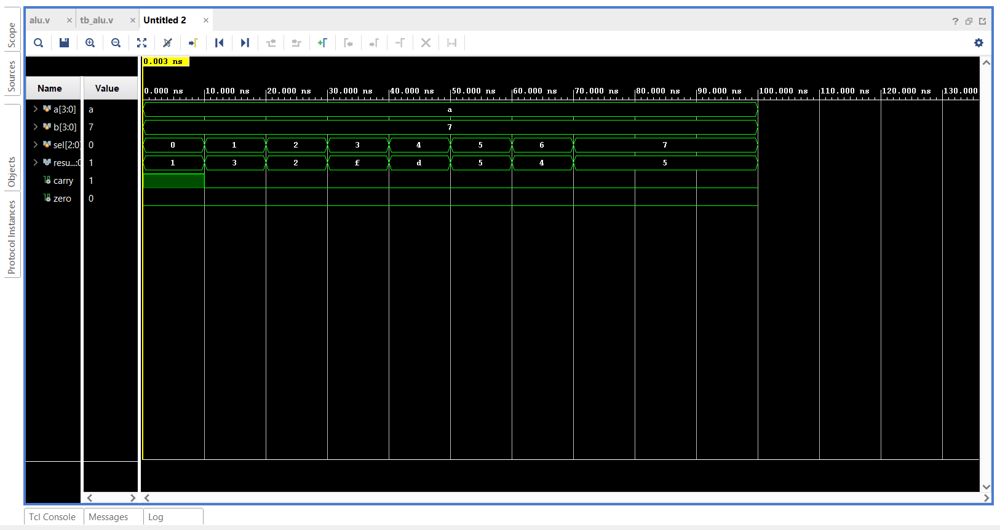
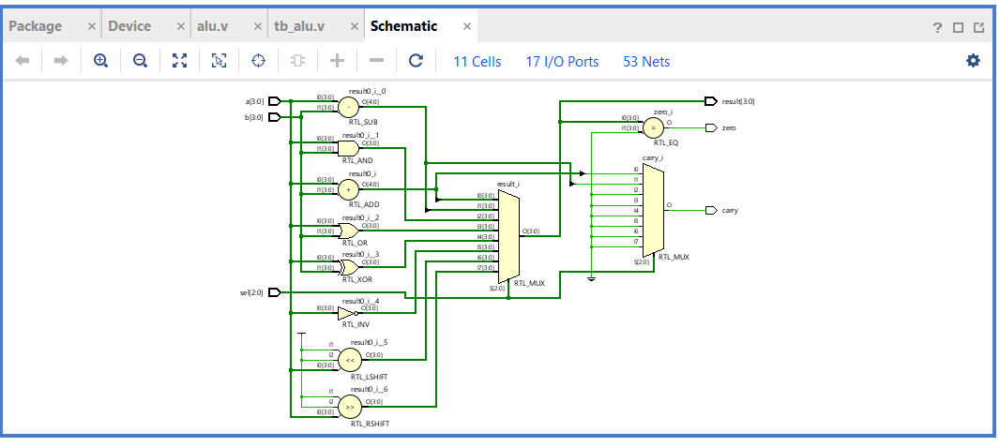
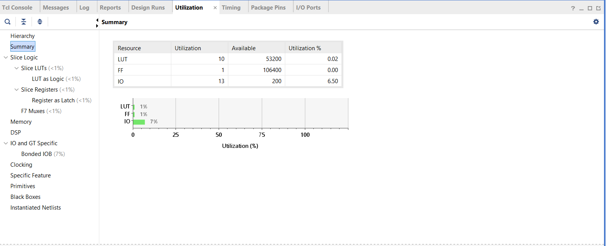

# 4-bit ALU using Verilog HDL

A 4-bit Arithmetic Logic Unit (ALU) designed using Verilog HDL and implemented, simulated, and synthesized using Xilinx Vivado.

## 📌 Project Overview

This project implements a 4-bit ALU capable of performing eight different arithmetic and logical operations.

The operation is selected using a 3-bit selection input (`sel`).

## ⚙️ Operations

| `sel` | Operation | Description |
|-------|-----------|-------------|
| `000` | Addition | `A + B` |
| `001` | Subtraction | `A - B` |
| `010` | AND | `A & B` |
| `011` | OR | `A \| B` |
| `100` | XOR | `A ^ B` |
| `101` | NOT | `~A` |
| `110` | Left Shift | `A << 1` |
| `111` | Right Shift | `A >> 1` |

## 🔌 Inputs

- `a[3:0]` – 4-bit input A
- `b[3:0]` – 4-bit input B
- `sel[2:0]` – 3-bit operation selector

## 📤 Outputs

- `result[3:0]` – 4-bit ALU result
- `carry` – Carry output for arithmetic operations
- `zero` – Indicates whether the result is zero

## 🛠️ Tools Used

- Verilog HDL
- Xilinx Vivado
- Behavioral Simulation
- RTL Analysis
- RTL Schematic
- FPGA Synthesis
- Resource Utilization Analysis

## 🔄 Design Flow

```text
Verilog HDL
     ↓
Testbench
     ↓
Behavioral Simulation
     ↓
RTL Elaboration
     ↓
RTL Schematic
     ↓
Synthesis
     ↓
Synthesized Schematic
     ↓
Resource Utilization
````

## 🧪 Simulation

The ALU was tested using a Verilog testbench in Xilinx Vivado.

The testbench verifies all eight operations using:

```text
A = 1010
B = 0111
```

Expected results:

| Operation   | Result              |
| ----------- | ------------------- |
| Addition    | `0001`, Carry = `1` |
| Subtraction | `0011`              |
| AND         | `0010`              |
| OR          | `1111`              |
| XOR         | `1101`              |
| NOT A       | `0101`              |
| Left Shift  | `0100`              |
| Right Shift | `0101`              |

## 📊 Synthesis Results

The design was synthesized using Xilinx Vivado.

| Resource  | Used | Available | Utilization |
| --------- | ---- | --------- | ----------- |
| LUT       | 10   | 53,200    | 0.02%       |
| Flip-Flop | 1    | 106,400   | 0.00%       |
| I/O       | 13   | 200       | 6.50%       |

## 📁 Project Structure

```text
4-bit-ALU-Verilog/
│
├── src/
│   └── alu.v
│
├── testbench/
│   └── tb_alu.v
│
└── screenshots/
    ├── waveform.png
    ├── rtl_schematic.png
    ├── synthesized_schematic.png
    └── utilization.png
```

## 🖼️ Project Screenshots

### Simulation Waveform

The behavioral simulation verifies the eight ALU operations.



### RTL Schematic

The RTL schematic generated by Vivado shows the arithmetic, logical, shift, and multiplexer logic used by the ALU.



### Synthesized Schematic

The synthesized design shows the FPGA resources used to implement the ALU, including LUTs and multiplexers.


### Resource Utilization

Vivado synthesis reports the FPGA resource utilization of the design.



## 🎯 Key Learning Outcomes

* Understanding the architecture of a basic ALU
* Designing combinational logic using Verilog HDL
* Writing a Verilog testbench
* Performing behavioral simulation in Vivado
* Understanding RTL schematics
* Understanding FPGA synthesis
* Analyzing FPGA resource utilization

## 👩‍💻 Author

**Sreenidhi**

